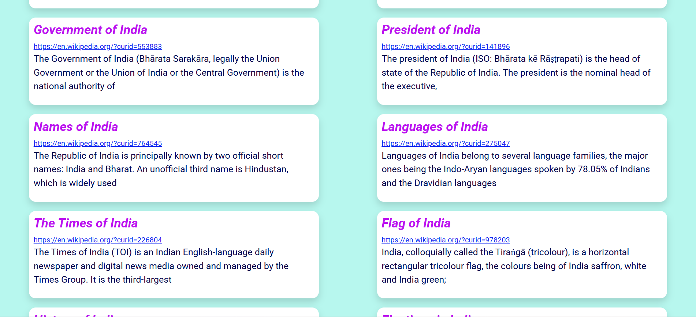

# 🚀 Wikipedia Search App

A simple and sleek web application that allows you to instantly search for and view Wikipedia articles. Perfect for quick research or just satisfying your curiosity!
---

## 🔗 Live Demo

Check out the live application here: [Wikipedia Search App](https://wikipediasapp13.ccbp.tech/)
 
---

## ✨ Features

- **Instant Search:** Find Wikipedia articles as you type.
- **Dynamic Display:** See article titles, URLs, and descriptions on the fly.
- **Clean UI:** A simple, responsive, and user-friendly interface.
- **Loading Spinner:** A subtle spinner lets you know when results are being fetched.

---

## 🛠️ Technologies Used

- HTML
- CSS
- JavaScript
- Wikipedia Search API (`https://apis.ccbp.in/wiki-search`)
- Bootstrap 4

---
## 📸 Screenshot



---

## 💻 Getting Started

1.  **Clone or download this repository.**
2.  Open the `index.html` file in your browser.
3.  Type a keyword into the search box and press Enter to start exploring!


---

## 📂 Project Structure
-The project structure for the Wikipedia Search App is as follows:
```
└── WikipediaSearchapp
  -└──WikiAssets
       -├── WikiScreenshot1.png
       -├── WikiScreenshot2.png
       -└── WikiScreenshot3.png
    -├── index.html
    -├── style.css
    -└── script.js

```
